[](https://github.com/jovandeginste/workout-tracker/blob/master/go.mod)
[](https://github.com/jovandeginste/workout-tracker/releases/latest)
[](https://github.com/jovandeginste/workout-tracker/releases/latest)

[](https://goreportcard.com/report/github.com/jovandeginste/workout-tracker)
[](https://libraries.io/go/github.com%2Fjovandeginste%2Fworkout-tracker%2Fv2)
[](https://opensource.org/licenses/MIT)
[](https://editor.swagger.io/?url=https://raw.githubusercontent.com/jovandeginste/workout-tracker/master/docs/swagger.json)

[](https://hosted.weblate.org/engage/workout-tracker/)

[](https://matrix.to/#/#workout-tracker:matrix.org)

A workout tracking web application for personal use (or family, friends), geared
towards running and other GPX-based activities

Self-hosted, everything included.

Chat with the community
[on Matrix](https://matrix.to/#/#workout-tracker:matrix.org)

## Features

- upload workout records (gpx, tcx or fit files)
  - manually, or automatically via API (eg. Fitotrack)
- keep track of personal daily stats (weight, step count, ...)
  - manually, or via API and sync (eg. [Fitbit](./cmd/fitbit-sync/))
- create manual workout records (weight lifting, push-ups, swimming, ...)
- create route segments to keep track of your progress
  - this application will try to detect matches of your workouts
- keep track of equipment you are using
- check your progress through statistics
- see your "heatmap": where have you been (a lot)?

## :heart: Donate your workout files :heart:

We are collecting real workout files for testing purposes. If you want to
support the project, donate your files. You can open an issue and attach the
file, or send a pull request.

We are looking for general files from all sources, but also "raw" files from
devices. The first file type can be edited to remove personal information, but
the second type should be as pure (raw) as possible.

Make sure the file does not contain personally identifiable information,
specifically your home address! Preferably, share files from workouts that you
recorded while travelling.

Be sure to add some metadata in the issue or pull request, such as:

- the activity type (running, swimming, ...)
- the general location's name (city, national park, ...)
- anything relevant, such as whether there is heart rate or cadence data, or any
  other data

By donating the files, you grant the project full permission to use them as they
see fit.

## Getting started

### Docker

Run the latest image from GitHub Container Registry (latest and release images
are available for amd64 and arm64). The current directory is mounted as the data
directory.

```bash
# Latest master build
docker run -p 8080:8080 -v .:/data ghcr.io/jovandeginste/workout-tracker:latest

# Tagged release
docker run -p 8080:8080 -v .:/data ghcr.io/jovandeginste/workout-tracker:2.0.2
docker run -p 8080:8080 -v .:/data ghcr.io/jovandeginste/workout-tracker:2.0
docker run -p 8080:8080 -v .:/data ghcr.io/jovandeginste/workout-tracker:2

# Latest release
docker run -p 8080:8080 -v .:/data ghcr.io/jovandeginste/workout-tracker:release

# Run as non-root user; make sure . is owned by uid 1000
docker run -p 8080:8080 -v .:/data -u 1000:1000 ghcr.io/jovandeginste/workout-tracker
```

Open your browser at `http://localhost:8080`

To persist data and sessions, run:

```bash
docker run -p 8080:8080 \
    -e WT_JWT_ENCRYPTION_KEY=my-secret-key \
    -v $PWD/data:/data \
    ghcr.io/jovandeginste/workout-tracker:master
```

or use docker compose

```bash
# Create directory that stores your data
mkdir -p /opt/workout-tracker
cd /opt/workout-tracker

# Download the docker compose file
## For sqlite as database:
curl https://raw.githubusercontent.com/jovandeginste/workout-tracker/master/docker-compose.sqlite.yaml --output docker-compose.yaml

## For postgres as database:
curl https://raw.githubusercontent.com/jovandeginste/workout-tracker/master/docker-compose.postgres.yaml --output docker-compose.yaml
curl https://raw.githubusercontent.com/jovandeginste/workout-tracker/master/postgres.env --output postgres.env

# Start the server
docker compose up -d
```

> **_NOTE:_** If using postgres, configure the parameters in `postgres.env`.

### Natively

Download a
[pre-built binary](https://github.com/jovandeginste/workout-tracker/releases) or
build it yourself (see [Development](#development) below).

Eg. for v2.0.2 on Linux x86_64:

```bash
wget https://github.com/jovandeginste/workout-tracker/releases/download/v2.0.2/workout-tracker-v2.0.2-linux-amd64.tar.gz
tar xf workout-tracker-v2.0.2-linux-amd64.tar.gz
./workout-tracker
```

To persist sessions, run:

```bash
export WT_JWT_ENCRYPTION_KEY=my-secret-key
./workout-tracker
```

This will create a new database file in the current directory and start the web
server at `http://localhost:8080`.

## Screenshots

### Login page

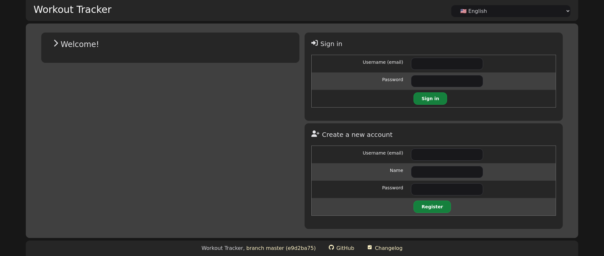

Login / registration form

- new users have to be activated by an admin
- registration can be disabled

### Dashboard


Dashboard view with:

- personal totals
- running records
- a calendar view
- recent activities (by you and other users)

### Overview of workouts

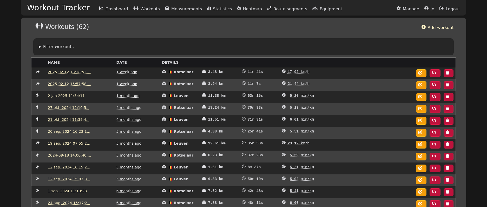

Overview of all your activities, with summaries.

### Details of a single workout

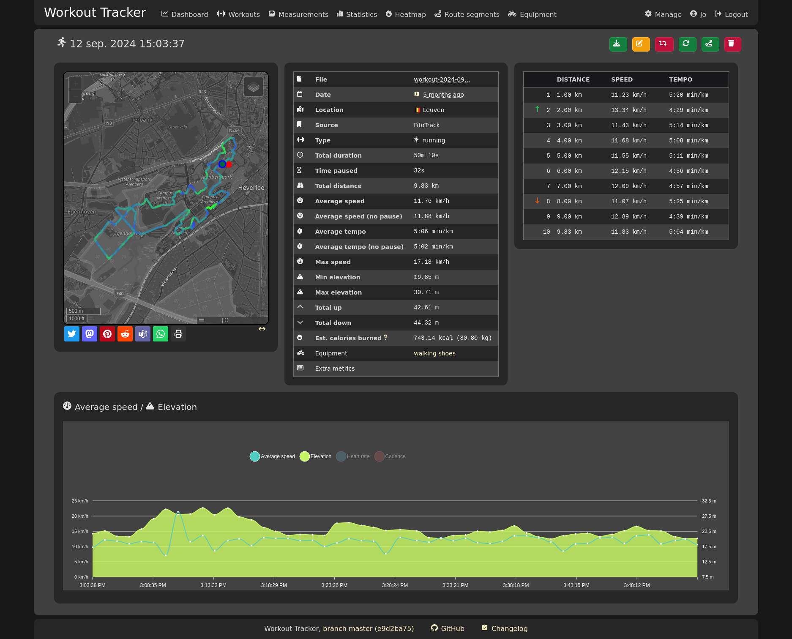

Details of a workout, with:

- a zoomable, dragable map of the GPX track with more details per point
- many summarized statistics
- a breakdown per kilometer or per mile
- track color based on elevation of the segment
- graph of average speed and elevation per minute
- optional graph of heart rate, cadans

### Tooltips for even more information


- green and red circle are start and end points of the track
- every point on the track has a tooltip with a summary at that moment
- hover over the breakdown per kilometer to highlight the point

### Upload your files

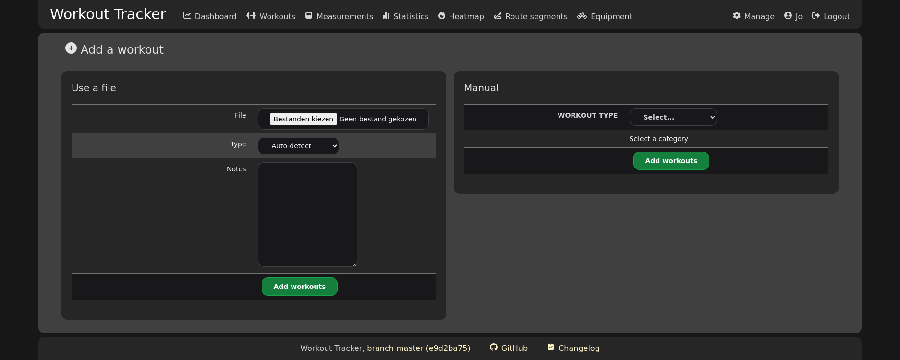

- Upload one or multiple GPX files.
- Pick the type (running, cycling, ...) or let the application guess based on
  average speed.
- The files are parsed when uploaded: statistics and other information are
  calculated and stored in the database (serialized).
- Or add a workout manually.

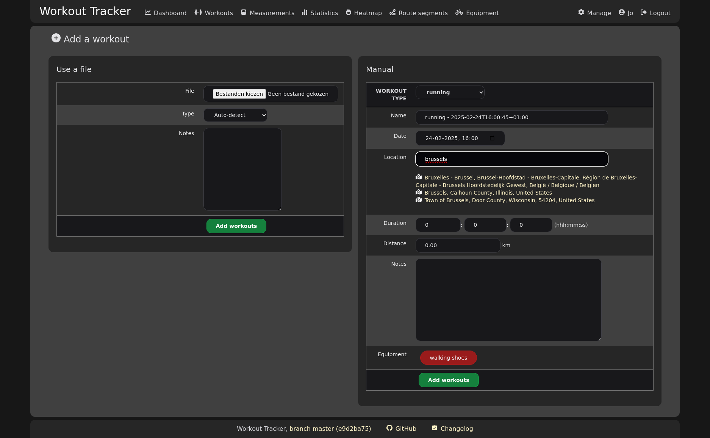

### Statistics to follow your progress

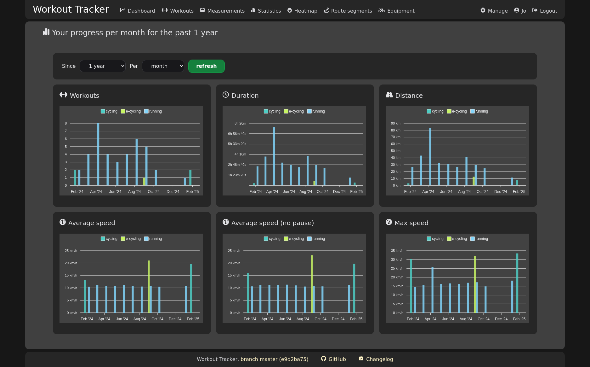

- Graphs showing monthly aggregated statistics.
- Pick different time range or bucket size.

### Heatmap: where have you been?

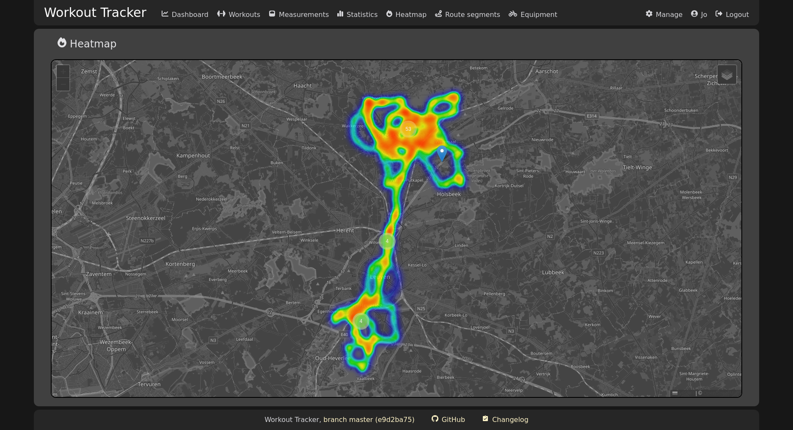

- Pan and zoom through over the map

### Daily measurements

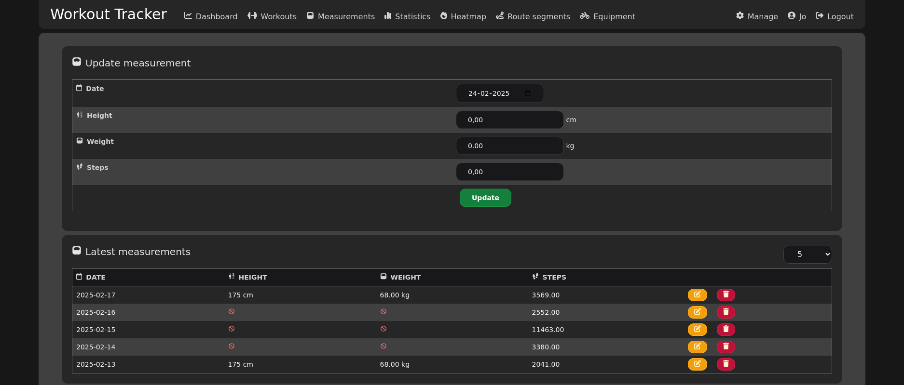

- Keep track of your daily stats, like weight and steps.
- Used to calculate estimated calories burned during a workout.

### Basic multi-language support

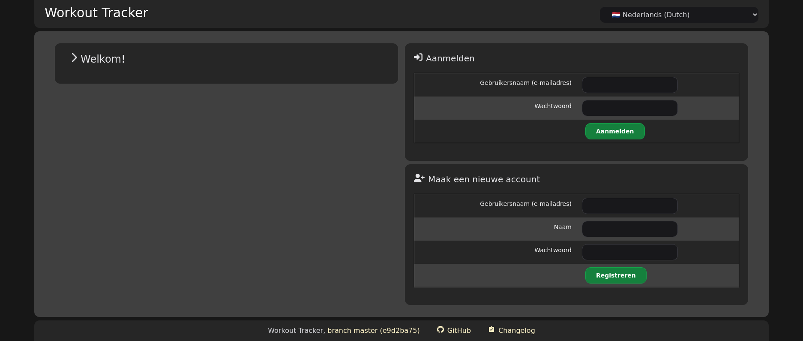


- Switch between (supported) languages
  - Please help translate via
    [Weblate](https://hosted.weblate.org/projects/workout-tracker/web-interface/)
- Use the language configured in the browser (default)
- Very limited amount of languages supported for now :smile:
- Re-calculate all previously uploaded workouts (useful while developing)

### Responsive design

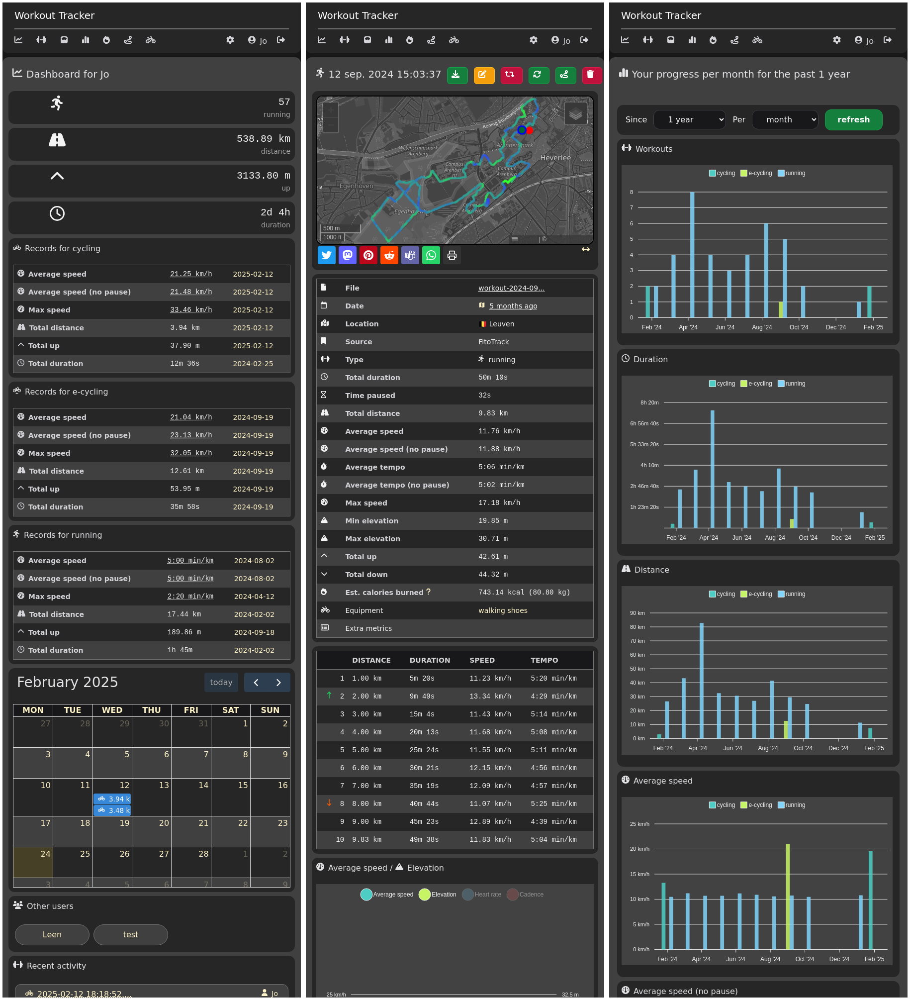

- Usable on small and medium screens

### Light and dark mode

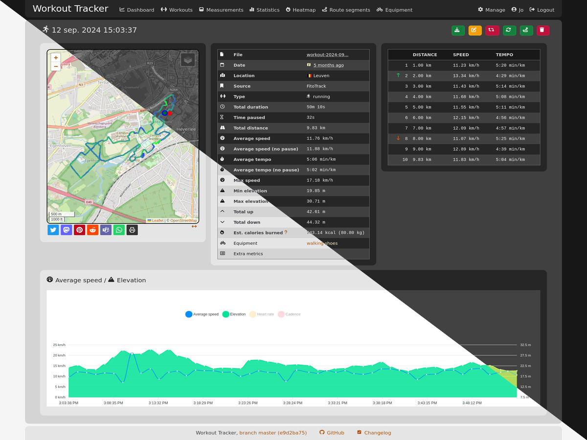

- Browser decides whether to use light or dark mode, based on your preferences

## Configuration

The web server looks for a file `workout-tracker.yaml` (or `json` or `toml`) in
the current directory, or takes it's configuration from environment variables.
The most important variable is the JWT encryption key. If you don't provide it,
the key is randomly generated every time the server starts, invalidating all
current sessions.

Generate a secure key and write it to `workout-tracker.yaml`:

```bash
echo "jwt_encryption_key: $(pwgen -c 32)" > workout-tracker.yaml
```

or export it as an environment variable:

```bash
export WT_JWT_ENCRYPTION_KEY="$(pwgen -c 32)"
```

See `workout-tracker.example.yaml` for more options and details.

Other environment variables, with their default values:

```bash
WT_BIND="[::]:8080"
WT_WEB_ROOT="/my-workout-tracker"
WT_LOGGING="true"
WT_DEBUG="false"
WT_DATABASE_DRIVER="sqlite"
WT_DSN="./database.db"
WT_REGISTRATION_DISABLED="false"
WT_SOCIALS_DISABLED="false"
WT_DEV="false"
```

After starting the server, you can access it at <http://localhost:8080> (the
default port). A login form is shown.

If no users are in the database (eg. when starting with an empty database), a
default `admin` user is created with password `admin`. You should change this
password in a production environment.

## API usage

The API is documented using
[swagger](https://editor.swagger.io/?url=https://raw.githubusercontent.com/jovandeginste/workout-tracker/master/docs/swagger.yaml).
You must enable API access for your user, and copy the API key. You can use the
API key as a query parameter (`?api-key=${API_KEY}`) or as a header
(`Authorization: Bearer ${API_KEY}`).

You can configure some tools to automatically upload files to Workout Tracker,
using the `POST /api/v1/import/$program` API endpoint.

### Daily measurements

You can set or update a daily measurement record:

```bash
curl -sSL -H "Authorization: bearer your-api-key" \
  http://localhost:8080/api/v1/daily \
  --data @- <<EOF
{
  "date": "2025-01-13",
  "weight": 70,
  "weight_unit": "kg",
  "height": 178,
  "height_unit": "cm"
}
EOF
```

### Workouts

#### Manual creation

You can create a workout manually:

```bash
curl -sSL -H "Authorization: bearer your-api-key" \
  http://localhost:8080/api/v1/workouts \
  --data @- <<EOF
{
  "name": "Workout name",
  "date": "2025-02-03T10:26",
  "duration_hours": 1,
  "duration_minutes": 10,
  "distance": 13,
  "type": "running"
}
EOF
```

#### Generic upload of a file

The generic upload endpoint takes the recording as body. Prepend the path with
`@` to tell `curl` to read the data from a file:

```bash
curl -sSL -H "Authorization: bearer your-api-key" \
  http://localhost:8080/api/v1/import/generic \
  --data @path/to/recorded.gpx
```

#### FitoTrack automatic GPX export

Read
[their documentation](https://codeberg.org/jannis/FitoTrack/wiki/Auto-Export)
before you continue.

The path to POST to is: `/api/v1/import/fitotrack?api-key=${API_KEY}`

## Development

### Build and run it yourself

- install go
- clone the repository

```bash
go build ./
./workout-tracker
```

This does not require npm or Tailwind, since the compiled css is included in the
repository.

### Do some development

You need to install Golang and npm.

Because I keep forgetting how to build every component, I created a Makefile.

```bash
# Make everything. This is also the default target.
make all # Run tests and build all components

# Install system dependencies
make install-dev-deps
# Install Javascript libraries
make install-deps

# Testing
make test # Runs all the tests
make test-assets test-go # Run tests for the individual components

# Building
make build # Builds all components
make build-frontend # Builds the frontend assets
make build-templates # Builds the templ templates
make build-server # Builds the web server (includes build-templates)
make build-docker # Performs all builds inside Docker containers, creates a Docker image
make build-swagger # Generates swagger docs


# Running it
make serve # Runs the compiled binary

# Cleanin' up
make clean # Removes build artifacts

# Development
make dev-docker # Runs the server in a docker compose setup
make dev-docker-sqlite # Runs the server in a docker compose setup with SQLite
make dev-docker-clean # Removes volumes created by the dev-docker targets
```

## What is this, technically?

A single binary that runs on any platform, with no dependencies.

The binary contains all assets to serve a web interface, through which you can
upload your GPX files, visualize your tracks and see their statistics and
graphs. The web application is multi-user, with a simple registration and
authentication form, session cookies and JWT tokens). New accounts are inactive
by default. An admin user can activate (or edit, delete) accounts. The default
database storage is a single SQLite file.

## What technologies are used

- Go, with some notable libraries
  - [gpxgo](github.com/tkrajina/gpxgo)
  - [Echo](https://echo.labstack.com/)
  - [Gorm](https://gorm.io)
  - [Spreak](https://github.com/vorlif/spreak)
  - [templ](https://templ.guide/)
  - [HTMX](https://htmx.org/)
- HTML, CSS and JS
  - [Tailwind CSS](https://tailwindcss.com/)
  - [Iconify Design](https://iconify.design/)
  - [FullCalendar](https://fullcalendar.io/)
  - [Leaflet](https://leafletjs.com/)
  - [apexcharts](https://apexcharts.com/)
- Docker

The application uses OpenStreetMap and Esri as its map providers and for
geocoding a GPS coordinate to a location.

## Compatiblity

This is a work in progress. If you find any problems, please let us know. The
application is tested with GPX files from these sources:

- Garmin Connect (export to GPX)
- FitoTrack (automatic export to GPX)
- Workoutdoors (export to GPX)
- Runtastic / Adidas Running using
  [this tool](https://github.com/Griffsano/RuntasticConverter)

## TODO

- write tests!!!!!
- add support for authentication through a reverse proxy
- add support for generic database drivers
  - added support for MySQL, but untested so far
  - added support for Postgres by @icewind1991
- add support for other types of import files (eg. Garmin fit files)
  - importing fit files works, kinda: there seems to be an issue with the
    elevation
  - see <https://github.com/tormoder/fit/issues/87>
  - <https://www.fitfileviewer.com/> gives the same elevation issue
